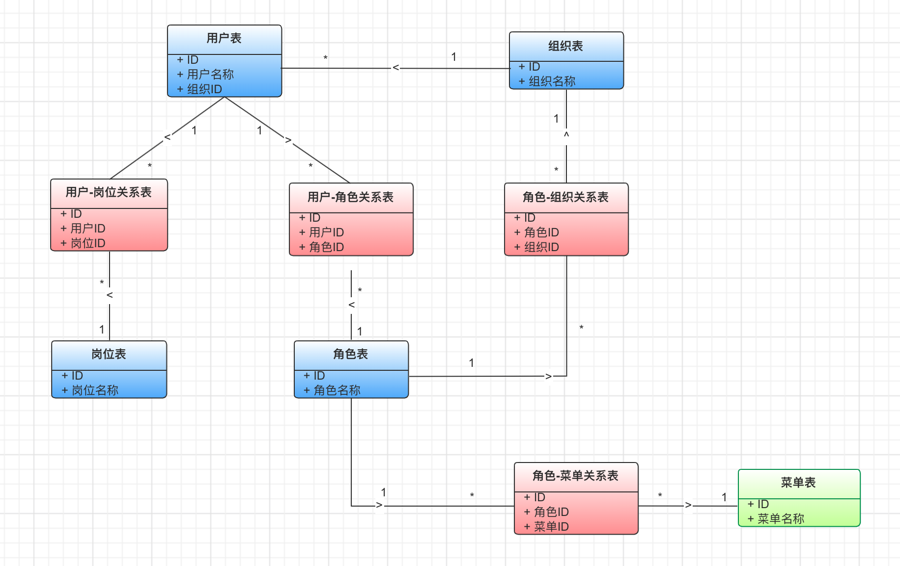

## 项目简介
    后管平台
    
## 接口文档
    http://localhost:port/doc.html

## 技术选型

- happy-code framework

## 本地构建
    列出本地开发过程中所用到的工具命令；

## 领域模型
    用户、组织、岗位、角色、菜单

## 测试策略
    自动化测试如何分类，哪些必须写测试，哪些没有必要写测试；

## 技术架构
- db设计

## 部署架构
    部署架构图；

## 外部依赖

## 环境信息
    各个环境的访问方式，数据库连接等；

## 编码实践
    统一的编码实践，比如异常处理原则、分页封装等；

## FAQ
    开发过程中常见问题的解答。